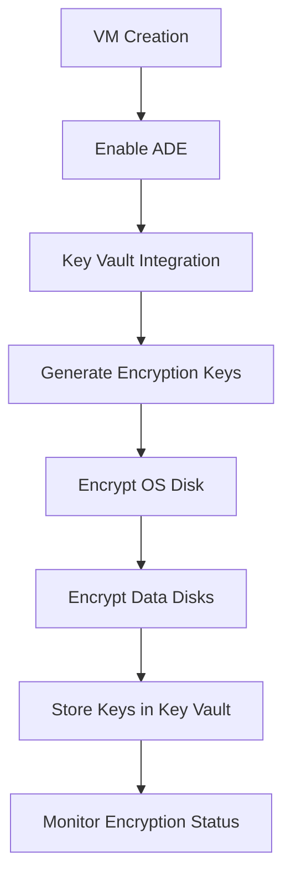

# Azure Disk Encryption

[](https://learn.microsoft.com/en-us/certifications/azure-administrator/)
[](https://azure.microsoft.com/en-us/products/category/compute/)

> **Secure your Azure virtual machines with enterprise-grade disk encryption**

## 🔐 Overview

Azure Disk Encryption (ADE) provides volume encryption for the OS and data disks of Azure virtual machines. It leverages industry-standard encryption technologies to protect your data at rest and help meet organizational security and compliance requirements.

### Key Benefits
- **Data Protection**: Encrypt VM disks using BitLocker (Windows) or dm-crypt (Linux)
- **Compliance**: Meet regulatory requirements for data encryption at rest
- **Integration**: Seamless integration with Azure Key Vault for key management
- **Performance**: Minimal impact on VM performance
- **Management**: Centralized encryption key management and monitoring

## 🏗️ Architecture Components

### Core Technologies
- **BitLocker Drive Encryption**: Windows OS and data disk encryption
- **dm-crypt**: Linux disk encryption subsystem
- **Azure Key Vault**: Centralized key and secret management
- **Azure Active Directory**: Identity and access management

### Encryption Flow


## 📋 Prerequisites

### Azure Key Vault Requirements
- Key Vault must be in the same region as the VM
- Key Vault must have the following access policies enabled:
  - **Azure Disk Encryption** for volume encryption
  - **Azure Resource Manager** for template deployment
  - **Azure Virtual Machines** for retrieving secrets

### VM Requirements
- **Windows**: Windows Server 2008 R2 or later
- **Linux**: Supported distributions (Ubuntu, RHEL, CentOS, SUSE, etc.)
- **Storage**: Premium or Standard managed disks
- **Agent**: Azure VM Agent must be installed and running

### Permissions Required
- **Contributor** role on the resource group
- **Key Vault Contributor** role on the Key Vault
- **Virtual Machine Contributor** role on the VM

## 🚀 Implementation Guide

### Step 1: Create and Configure Key Vault

```powershell
# Create Resource Group
New-AzResourceGroup -Name "rg-encryption-demo" -Location "East US"

# Create Key Vault
$keyVault = New-AzKeyVault `
    -Name "kv-encryption-demo-001" `
    -ResourceGroupName "rg-encryption-demo" `
    -Location "East US" `
    -EnabledForDiskEncryption `
    -EnabledForDeployment `
    -EnabledForTemplateDeployment

# Create Key Encryption Key (KEK)
$kek = Add-AzKeyVaultKey `
    -VaultName "kv-encryption-demo-001" `
    -Name "DiskEncryptionKey" `
    -Destination "Software"
```

### Step 2: Enable Encryption on Windows VM

```powershell
# Define variables
$vmName = "vm-windows-001"
$resourceGroupName = "rg-encryption-demo"
$keyVaultName = "kv-encryption-demo-001"
$keyVaultResourceId = (Get-AzKeyVault -VaultName $keyVaultName -ResourceGroupName $resourceGroupName).ResourceId
$keyVaultUrl = (Get-AzKeyVault -VaultName $keyVaultName -ResourceGroupName $resourceGroupName).VaultUri
$kekUrl = (Get-AzKeyVaultKey -VaultName $keyVaultName -Name "DiskEncryptionKey").Key.kid

# Enable encryption
Set-AzVMDiskEncryptionExtension `
    -ResourceGroupName $resourceGroupName `
    -VMName $vmName `
    -KeyVaultURL $keyVaultUrl `
    -KeyVaultResourceId $keyVaultResourceId `
    -KeyEncryptionKeyUrl $kekUrl `
    -VolumeType "All" `
    -Force
```

### Step 3: Enable Encryption on Linux VM

```bash
# Azure CLI commands for Linux VM encryption
az vm encryption enable \
    --resource-group rg-encryption-demo \
    --name vm-linux-001 \
    --disk-encryption-keyvault kv-encryption-demo-001 \
    --key-encryption-key DiskEncryptionKey \
    --volume-type all
```

### Step 4: Verify Encryption Status

```powershell
# Check encryption status
Get-AzVmDiskEncryptionStatus -VMName $vmName -ResourceGroupName $resourceGroupName

# Example output:
# OsVolumeEncrypted         : Encrypted
# DataVolumesEncrypted      : Encrypted
# OsVolumeEncryptionSettings : Microsoft.Azure.Management.Compute.Models.DiskEncryptionSettings
# ProgressMessage           : Provisioning succeeded
```

## 🛠️ Advanced Configuration

### Dual Pass Encryption
For enhanced security, enable dual pass encryption (encrypt with both platform-managed and customer-managed keys):

```powershell
Set-AzVMDiskEncryptionExtension `
    -ResourceGroupName $resourceGroupName `
    -VMName $vmName `
    -KeyVaultURL $keyVaultUrl `
    -KeyVaultResourceId $keyVaultResourceId `
    -KeyEncryptionKeyUrl $kekUrl `
    -VolumeType "All" `
    -EncryptionOperation "EnableEncryptionWithCustomerManagedKey" `
    -Force
```

### ARM Template Deployment

```json
{
    "$schema": "https://schema.management.azure.com/schemas/2019-04-01/deploymentTemplate.json#",
    "contentVersion": "1.0.0.0",
    "parameters": {
        "vmName": {
            "type": "string",
            "metadata": {
                "description": "Name of the virtual machine"
            }
        },
        "keyVaultName": {
            "type": "string",
            "metadata": {
                "description": "Name of the Key Vault"
            }
        }
    },
    "resources": [
        {
            "type": "Microsoft.Compute/virtualMachines/extensions",
            "apiVersion": "2021-03-01",
            "name": "[concat(parameters('vmName'), '/AzureDiskEncryption')]",
            "properties": {
                "publisher": "Microsoft.Azure.Security",
                "type": "AzureDiskEncryption",
                "typeHandlerVersion": "2.2",
                "autoUpgradeMinorVersion": true,
                "settings": {
                    "KeyVaultURL": "[reference(resourceId('Microsoft.KeyVault/vaults', parameters('keyVaultName'))).vaultUri]",
                    "KeyVaultResourceId": "[resourceId('Microsoft.KeyVault/vaults', parameters('keyVaultName'))]",
                    "VolumeType": "All",
                    "EncryptionOperation": "EnableEncryption"
                }
            }
        }
    ]
}
```

## 🔍 Monitoring and Management

### Azure Monitor Integration
```powershell
# Query encryption status across multiple VMs
$subscriptionId = "your-subscription-id"
$query = @"
Resources
| where type == "microsoft.compute/virtualmachines"
| extend encryptionStatus = properties.storageProfile.osDisk.encryptionSettings.enabled
| project name, resourceGroup, location, encryptionStatus
| where encryptionStatus == true
"@

Search-AzGraph -Query $query -Subscription $subscriptionId
```

### Log Analytics Queries
```kusto
// Monitor disk encryption events
AzureActivity
| where OperationNameValue contains "diskEncryption"
| project TimeGenerated, Caller, OperationNameValue, ActivityStatusValue, ResourceId
| sort by TimeGenerated desc
```

## 🚨 Troubleshooting

### Common Issues and Solutions

#### Issue: Extension Installation Fails
**Symptoms**: AzureDiskEncryption extension fails to install
**Solutions**:
- Verify VM Agent is running and up to date
- Check Key Vault permissions and access policies
- Ensure VM has internet connectivity
- Verify sufficient disk space (minimum 8GB free)

#### Issue: Encryption Progress Stuck
**Symptoms**: Encryption appears to hang or progress slowly
**Solutions**:
```powershell
# Check extension logs
Get-AzVMExtension -ResourceGroupName $resourceGroupName -VMName $vmName -Name "AzureDiskEncryption"

# Restart the encryption process
Remove-AzVMExtension -ResourceGroupName $resourceGroupName -VMName $vmName -Name "AzureDiskEncryption" -Force
# Re-run encryption command
```

#### Issue: Key Vault Access Denied
**Symptoms**: "Access denied" errors during encryption
**Solutions**:
- Verify Key Vault access policies include required services
- Check Azure AD permissions
- Ensure Key Vault and VM are in the same region

### Diagnostic Commands
```powershell
# Windows VM diagnostics
Invoke-AzVMRunCommand -ResourceGroupName $resourceGroupName -VMName $vmName -CommandId 'RunPowerShellScript' -ScriptString 'manage-bde -status'

# Linux VM diagnostics
Invoke-AzVMRunCommand -ResourceGroupName $resourceGroupName -VMName $vmName -CommandId 'RunShellScript' -ScriptString 'lsblk'
```

## 📊 Performance Considerations

### Encryption Impact
- **CPU Usage**: 5-10% increase during encryption process
- **I/O Performance**: Minimal impact (<5%) after encryption completion
- **Boot Time**: Slight increase (10-30 seconds) for encrypted VMs
- **Memory**: Additional 1-2GB RAM usage during encryption

### Optimization Tips
- Schedule encryption during maintenance windows
- Monitor VM performance during encryption
- Consider Premium SSD for better performance
- Use accelerated networking when available

## 🔒 Security Best Practices

### Key Management
- **Rotate Keys Regularly**: Implement key rotation policies
- **Backup Keys**: Store backup copies in secure locations
- **Access Control**: Use principle of least privilege
- **Audit Logs**: Enable Key Vault logging and monitoring

### Network Security
- **Private Endpoints**: Use private endpoints for Key Vault access
- **Network Policies**: Implement network access restrictions
- **Firewall Rules**: Configure Key Vault firewall rules

### Compliance Considerations
- **Data Residency**: Ensure keys remain in required geographic regions
- **Audit Trails**: Maintain comprehensive audit logs
- **Documentation**: Document encryption procedures and key management

## 🧪 Lab Exercise

### Hands-On Practice: Encrypt a Windows VM

**Objective**: Deploy and encrypt a Windows VM using Azure Disk Encryption

**Prerequisites**:
- Azure subscription with contributor access
- PowerShell with Az modules installed
- Basic understanding of Azure VMs and Key Vault

**Steps**:
1. Create a resource group and Key Vault
2. Deploy a Windows VM
3. Configure Key Vault permissions
4. Enable disk encryption
5. Verify encryption status
6. Test VM functionality

**Expected Duration**: 45-60 minutes

**Validation Criteria**:
- [ ] VM boots successfully after encryption
- [ ] Both OS and data disks are encrypted
- [ ] Encryption keys are stored in Key Vault
- [ ] Monitoring shows successful encryption status

## 📚 Additional Resources

### Microsoft Documentation
- [Azure Disk Encryption Overview](https://docs.microsoft.com/en-us/azure/security/fundamentals/azure-disk-encryption-vms-vmss)
- [Key Vault Integration](https://docs.microsoft.com/en-us/azure/key-vault/general/disk-encryption)
- [Troubleshooting Guide](https://docs.microsoft.com/en-us/azure/security/fundamentals/disk-encryption-troubleshooting)

### PowerShell and CLI References
- [Set-AzVMDiskEncryptionExtension](https://docs.microsoft.com/en-us/powershell/module/az.compute/set-azvmdiskencryptionextension)
- [az vm encryption](https://docs.microsoft.com/en-us/cli/azure/vm/encryption)

### Security Frameworks
- **NIST**: Encryption standards and guidelines
- **ISO 27001**: Information security management
- **SOC 2**: Security and availability controls

## 🎯 Exam Tips for AZ-104

### Key Concepts to Remember
- Azure Disk Encryption uses BitLocker (Windows) and dm-crypt (Linux)
- Key Vault integration is required for key management
- Both OS and data disks can be encrypted
- Encryption can be enabled during or after VM deployment
- Performance impact is minimal after encryption completion

### Common Exam Questions
- **Scenario**: Which Azure service manages encryption keys for ADE?
  **Answer**: Azure Key Vault
- **Scenario**: What permissions are required to enable disk encryption?
  **Answer**: Key Vault access policies for Azure Disk Encryption
- **Scenario**: How to verify encryption status?
  **Answer**: Use Get-AzVmDiskEncryptionStatus PowerShell cmdlet

### Hands-On Skills
- Enable disk encryption using PowerShell and Azure CLI
- Configure Key Vault access policies
- Troubleshoot encryption issues
- Monitor encryption status and performance

---

## 🤝 Contributing

Found an issue or want to improve this guide? We welcome contributions!

1. **Report Issues**: Use GitHub issues for bugs or suggestions
2. **Submit PRs**: Fork the repo and submit pull requests
3. **Share Feedback**: Join the [Refactored Community](https://www.refactored.pro/membership)

---

*This guide is part of the comprehensive AZ-104 training materials from [Refactored.pro](https://www.refactored.pro). For more Azure learning resources and expert-led training, visit our platform.*

[](https://www.refactored.pro/course-az-104)