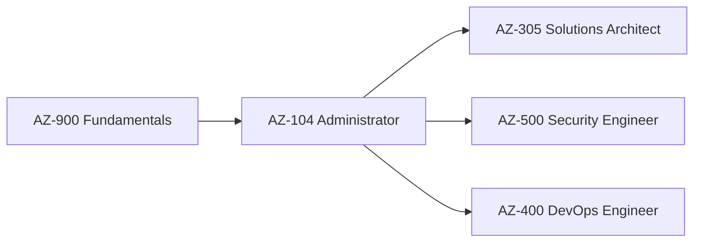

# Microsoft Azure Administrator AZ-104

[](https://www.refactored.pro)
[](https://learn.microsoft.com/en-us/certifications/azure-administrator/)
[](LICENSE)

> **Transform your Azure journey with expert-led training from Refactored.pro**

## 🎯 About This Repository

This repository contains comprehensive study materials, lab exercises, and practical resources for the **Microsoft AZ-104: Azure Administrator Associate** certification. Developed by the expert instructors at [Refactored.pro](https://www.refactored.pro), this content is designed to help IT professionals master Azure administration and pass the AZ-104 certification exam.

## 🚀 What You'll Learn

The AZ-104 certification validates your ability to implement, manage, and monitor Azure environments. This repository covers all exam objectives:

### Core Skills Domains

- **Manage Azure identities and governance** (15-20%)
  - Microsoft Entra ID (Azure AD) management
  - Role-based access control (RBAC)
  - Subscriptions and governance policies

- **Implement and manage storage** (15-20%)
  - Storage accounts and blob storage
  - File shares and disk management
  - Data protection and backup strategies

- **Deploy and manage Azure compute resources** (20-25%)
  - Virtual machines and containers
  - Azure App Service and serverless computing
  - Auto-scaling and load balancing

- **Configure and manage virtual networking** (20-25%)
  - Virtual networks and subnets
  - Network security groups and routing
  - VPN and ExpressRoute connectivity

- **Monitor and maintain Azure resources** (10-15%)
  - Azure Monitor and Log Analytics
  - Backup and disaster recovery
  - Performance optimization

## 📁 Repository Structure

```
├── 📁 labs/                    # Hands-on lab exercises
│   ├── lab-01-identities/      # Identity and governance labs
│   ├── lab-02-storage/         # Storage management labs
│   ├── lab-03-compute/         # Compute resource labs
│   ├── lab-04-networking/      # Virtual networking labs
│   └── lab-05-monitoring/      # Monitoring and maintenance labs
├── 📁 study-guides/            # Comprehensive study materials
├── 📁 scripts/                 # PowerShell and Azure CLI scripts
├── 📁 templates/               # ARM templates and Bicep files
├── 📁 practice-exams/          # Mock exam questions
└── 📁 resources/               # Additional learning resources
```

## 🎓 About Refactored.pro

[Refactored.pro](https://www.refactored.pro) is a leading online learning platform specializing in cloud computing, DevOps, cybersecurity, and leadership skills for technical professionals. Founded in 2017, Refactored has helped thousands of students advance their careers through:

- **Expert-Led Training**: Courses taught by Microsoft Certified Trainers (MCTs) and MVPs
- **Hands-On Labs**: Real-world scenarios and practical demonstrations
- **Community Support**: Access to a vibrant community of IT professionals
- **Career Guidance**: Tailored learning paths and career roadmaps
- **Up-to-Date Content**: Regular updates aligned with the latest Azure services

### Featured Instructor: Nick Colyer

The AZ-104 course is led by **Nick Colyer**, Founder of Refactored.pro and VP of Digital Engineering at AHEAD, LLC. With over 25 years of IT expertise, Nick is a:
- Microsoft Certified Trainer (MCT)
- Microsoft Most Valuable Professional (MVP)
- Trusted educator with thousands of successful students worldwide

## 🎯 Prerequisites

Before starting this course, you should have:

- Basic understanding of networking, storage, compute, and virtualization concepts
- Familiarity with operating systems (Windows/Linux)
- General knowledge of IT administration
- Basic understanding of PowerShell and command-line interfaces
- An active Azure subscription for hands-on practice

## 🚀 Getting Started

1. **Clone this repository**:
   ```bash
   git clone https://github.com/refactoredpro/AZ-104.git
   cd AZ-104
   ```

2. **Set up your Azure environment**:
   - Create a free Azure account at [azure.microsoft.com](https://azure.microsoft.com/free/)
   - Install Azure CLI and PowerShell modules
   - Configure your development environment

3. **Follow the learning path**:
   - Start with the study guides in `/study-guides/`
   - Complete hands-on labs in `/labs/`
   - Practice with scripts in `/scripts/`
   - Test your knowledge with practice exams

4. **Join the community**:
   - Enroll in a [Refactored.pro membership](https://www.refactored.pro/membership)
   - Connect with fellow learners and industry professionals
   - Access additional resources and career guidance

## 📚 Additional Resources

### Official Microsoft Resources
- [AZ-104 Exam Page](https://learn.microsoft.com/en-us/certifications/azure-administrator/)
- [Azure Documentation](https://docs.microsoft.com/en-us/azure/)
- [Microsoft Learn - AZ-104 Learning Path](https://learn.microsoft.com/en-us/training/paths/az-104-administrator-prerequisites/)

### Refactored.pro Resources
- [AZ-104 Training Course](https://courses.refactored.pro/p/az-104)
- [Azure Study Guides](https://www.refactored.pro/study-guides)
- [Community Forums](https://www.refactored.pro/membership)

## 🏆 Certification Path

The AZ-104 certification is a crucial step in your Azure journey:



## 💡 Study Tips

- **Hands-on Practice**: Azure is best learned by doing. Complete all lab exercises
- **Regular Review**: Use spaced repetition with the practice questions
- **Community Engagement**: Join study groups and discussion forums
- **Real-world Application**: Apply concepts in your current work environment
- **Time Management**: Allocate 3-4 weeks for comprehensive preparation

## 🤝 Contributing

We welcome contributions to improve this repository:

1. Fork the repository
2. Create a feature branch (`git checkout -b feature/improvement`)
3. Commit your changes (`git commit -am 'Add new lab exercise'`)
4. Push to the branch (`git push origin feature/improvement`)
5. Create a Pull Request

## 📄 License

This project is licensed under the MIT License - see the [LICENSE](LICENSE) file for details.

## 🆘 Support

- **Technical Issues**: Open an issue in this repository
- **Course Questions**: Contact [Refactored.pro support](https://support.refactored.pro)
- **Community Help**: Join the [Refactored Community](https://www.refactored.pro/membership)

## 🌟 Success Stories

> *"I can't stress enough how difficult it is to find quality, up-to-date training material about Microsoft Azure. The Refactored team is second-to-none in knowledge, experience, and capability to turn even the most abstract topics into easy to consume concepts."* - Refactored Student

> *"Thank you Refactored for the great content that helped me pass my AZ-104 exam to get my Azure Administrator Associate certification."* - Certified Professional

---

**Ready to transform your Azure career?** 🚀

Start your journey today with [Refactored.pro](https://www.refactored.pro) and join thousands of successful Azure professionals!

[](https://www.refactored.pro/membership)